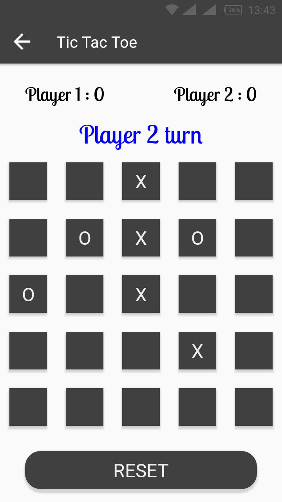

# TIC TAC TOE
This is the classic tic tac toe game implemented in Android as part of the ALC 2.0 Take a Climb Challenge.

## Installation
Install the apk file in your phone **(app-debug.apk)**.

The apk file is located in the [release](https://github.com/sheilambadi/tic-tac-toe/releases "Tic Tac Toe Game") section as illustrated

## Usage
After installing a take the following steps to play the game.
1. Choose the number of players.
  * Single player ~ play against computer
  * Multi player ~ play against a human player on the same phone in turns

2. After selecting either singleplayer or multiplayer:
  * Select whether to play with X or O
  * Choose board size
  
**NB: In multiplayer mode, only player one picks X or O and the other is assigned to player 2 automatically**

3. The different boards for the **single player** board are as shown:

***NOTE: The score card is displayed next to the Player 1 and Player 2 texts***

4. The boards for **multiplayer mode** are as show with a _player turn_ text displayed for the two players to know who is to play.

 
 5. There are Toast messages at the bottom of the screen to show the player that *wins and if there is a draw* 
 

 
 6. There is also the reset button that resets the board and score card
 
 ## License
 
**MIT License**

&copy; 2018 Sheila Mbadi

Permission is hereby granted, free of charge, to any person obtaining a copy
of this software and associated documentation files (the "Software"), to deal
in the Software without restriction, including without limitation the rights
to use, copy, modify, merge, publish, distribute, sublicense, and/or sell
copies of the Software, and to permit persons to whom the Software is
furnished to do so, subject to the following conditions:

The above copyright notice and this permission notice shall be included in all
copies or substantial portions of the Software.

THE SOFTWARE IS PROVIDED "AS IS", WITHOUT WARRANTY OF ANY KIND, EXPRESS OR
IMPLIED, INCLUDING BUT NOT LIMITED TO THE WARRANTIES OF MERCHANTABILITY,
FITNESS FOR A PARTICULAR PURPOSE AND NONINFRINGEMENT. IN NO EVENT SHALL THE
AUTHORS OR COPYRIGHT HOLDERS BE LIABLE FOR ANY CLAIM, DAMAGES OR OTHER
LIABILITY, WHETHER IN AN ACTION OF CONTRACT, TORT OR OTHERWISE, ARISING FROM,
OUT OF OR IN CONNECTION WITH THE SOFTWARE OR THE USE OR OTHER DEALINGS IN THE
SOFTWARE.
